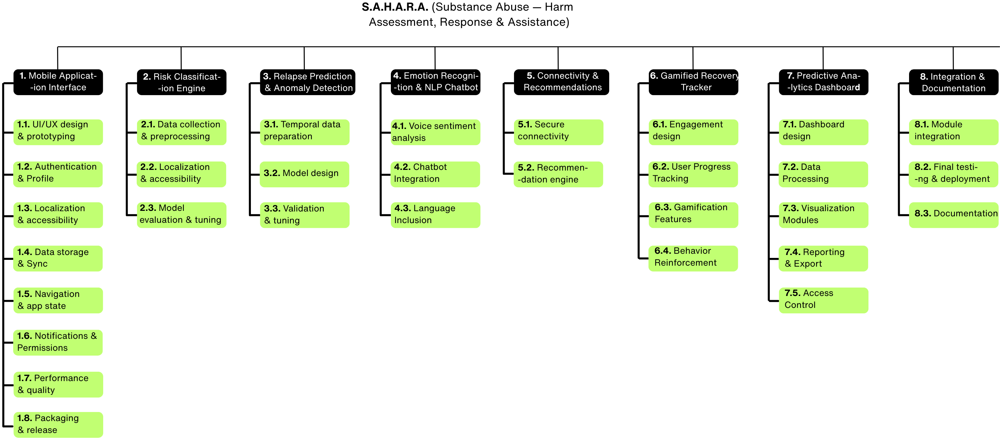

<div align="center">
    
    <h1>S.A.H.A.R.A.</h1>
    <p><strong>S</strong>ubstance <strong>A</strong>buse — <strong>H</strong>arm <strong>A</strong>ssessment, <strong>R</strong>esponse & <strong>A</strong>ssistance</p>
</div>

---

> [!CAUTION]
> This project is currently in **active development phase**. Features are being implemented and are subject to change. 
> The app is not yet ready for production use. Use at your own risk and for research/testing purposes only!

---

<div align="center">

[](https://www.gnu.org/licenses/gpl-3.0)
[](#)
[](https://patreon.com/project_sahara)

</div>

---

## Overview

<p align="justify">
We aspire S.A.H.A.R.A. to be AI-driven Android application designed to detect and prevent early-stage drug misuse among Pakistani youth, whether it is prescription-based or otherwise. The app transitions seamlessly to full abuse prevention (stopping misuse ==> no future abuse) through multimodal analysis and empathetic support, addressing Pakistan's growing substance abuse crisis with culturally sensitive, privacy-first interventions.
</p>

---

## Project Context

<p align="justify">
In mid-2025, drug abuse in Pakistan has escalated dramatically. The UNODC World Drug Report 2025 highlights global trends compounding this crisis, with Pakistan facing 6.7-10 million drug users, over 800,000 heroin-dependent individuals, and prescription opioids like benzodiazepines showing 41% misuse rates among youth.
</p>

<p align="justify">
Early intervention is critical, as misuse of prescription drugs (e.g., painkillers, sedatives) often precedes harder substance abuse, exacerbated by peer pressure, mental health issues, and stigma. With mobile penetration at 75.2% (190 million connections) and 77% of smartphone users aged 21-30, this app leverages high youth accessibility for proactive screening and support.
</p>

---

## Key Features

- **🔬 AI-Powered Detection**: 85%+ accurate early risk detection via behavioral analysis, voice patterns, phone usage, and culturally adapted text inputs
- **🤖 Multilingual Support**: 24/7 chatbot support in English, Urdu script, and Roman Urdu
- **🎮 Gamified Recovery**: Engaging recovery tracking with rewards and milestones
- **🗺️ Anonymous Connectivity**: NGO/counselor connections via Google Maps integration
- **🔒 Privacy-First**: AES-256 encryption and anonymous usage to address cultural barriers
- **📊 Professional Dashboard**: Analytics for NGOs and healthcare professionals

---

## Work Breakdown Structure

<div align="center">
    
</div>

---

## Technology Stack

- **Frontend**: Android Studio (Kotlin/Java)
- **ML/AI**: Hugging Face Transformers, TensorFlow Lite
- **Backend**: Firebase (Authentication, Firestore, Storage)
- **APIs**: Google Maps API, speech recognition APIs
- **Security**: AES-256 encryption
- **Training Datasets**: FER-2013, RAVDESS (with domain adaptation)

---

## Development Phase Setup

### Prerequisites

Make sure you have the following installed:
- [Git](https://git-scm.com/downloads) | `git --version`
- [Android Studio](https://developer.android.com/studio) | Check via Help > About
- [Python 3.x](https://www.python.org/downloads/) (for ML model training) | `python -V` and `pip -V`

> **Note:** Python is used for prototyping and training ML models (e.g., with Hugging Face). The app itself is in Kotlin/Java.

### 1. Configuring Git

Configure Git globally if you haven't done so already:
```bash
git config --global user.email "your-email@example.com"
git config --global user.name "Your Name or Username"
git config --global core.editor "code --wait"  # If using VS Code; adjust if needed
```

### 2. Clone the Repository

Make sure that your terminal's path is set to your Desktop or a preferred workspace:
```bash
git clone https://codeberg.org/solarmane/project-sahara_pk.git
```

### 3. Open and Set Up the Project

1. Open the cloned repository in Android Studio.
2. Sync the project with Gradle files (File > Sync Project with Gradle Files).
3. Install required dependencies: Android Studio will prompt for any missing SDKs or tools.
4. Set up Firebase:
    - Create a Firebase project at [console.firebase.google.com](https://console.firebase.google.com).
    - Download `google-services.json` and place it in the `app/` directory.
5. Configure Google Maps API:
    - Obtain an API key from [Google Cloud Console](https://console.cloud.google.com).
    - Add it to `AndroidManifest.xml` under `<meta-data android:name="com.google.android.geo.API_KEY">`.
6. For ML components:
    - Install Python libraries: `pip install torch transformers datasets`.
    - Training scripts (if added) can be run from the `ml/` directory (create if needed).
7. Build and run the app on an emulator or device (Run > Run 'app').

> **Note:** Replace placeholder API keys and configurations with your own. For Firebase, update database rules for security. ML models may require fine-tuning on datasets like FER-2013; scripts will be added soon.

### 4. Final Steps

- **Test the app**: Grant camera/mic permissions and interact with the chatbot.
- **Train ML models**: Use public datasets for emotion detection; domain adaptation techniques (e.g., DANN) for multilingual support.
- **Contribute**: After making changes in your branch, commit, push, and submit a pull request for review.

---

## Project Timeline

**Phase 1 & 2 Duration**: October 2025 – June 2026

| State | Timeline | Deliverables |
|-------|----------|-------------|
| **1** | Oct 2025 | Literature review, system architecture, UI/UX design |
| **2** | Nov - Dec 2025 | Risk classification engine, relapse prediction models |
| **3** | Jan - Feb 2026 | Emotion recognition, NLP chatbot, connectivity system |
| **4** | Mar 2026 | Gamified tracker, analytics dashboard |
| **5** | Apr - May 2026 | System integration, testing, debugging |
| **6** | Jun 2026 | Documentation, final review, presentation |

---

## Support the Project

<div align="center">

### 🌟 Beta Testing Program

Join our beta testing community and help shape the future of substance abuse prevention technology!

[](https://patreon.com/project_sahara)

*Your support helps us continue developing this life-saving technology for Pakistani youth.*

</div>

---

## License

This project is licensed under the **GNU General Public License v3.0 (GPL-3.0)**.
See the [LICENSE](./LICENSE.md) file for the full text.

### Additional Notice for the S.A.H.A.R.A. Project

S.A.H.A.R.A. and its ML models included in this repository are provided **as-is**, with no guarantee of accuracy, completeness, or reliability in detecting substance abuse patterns.

**Users are responsible for:**
- Understanding that this is a research/development project, not a medical device
- Seeking professional medical advice for substance abuse issues
- Ensuring appropriate usage in their environment
- Handling potential false positives or misclassifications in AI predictions
- Complying with local privacy and healthcare regulations

**Important:** This application is **not a substitute** for professional medical diagnosis or treatment. Always consult qualified healthcare professionals for substance abuse concerns.

These disclaimers are **in addition to** the GNU GPL v3.0 terms.

---

## Contact & Contributions

<p align="justify">
For issues, suggestions, or contributions, please open an issue on Codeberg. We welcome community involvement in making this project a success for Pakistani youth and the broader community affected by substance abuse.
</p>

---

## Team

**University of Central Punjab - Faculty of Information Technology**

- **F. Yaseen** (L1F22\<redacted_for_privacy>)
- **A. R. Tariq** (L1F22\<redacted_for_privacy>)
- **M. A. Y. Haider** (L1S22\<redacted_for_privacy>)

**Project Advisor:** Prof. U. Aamer

---

<div align="center">
    <p><em>Building a safer, stigma-free future for Pakistani youth</em></p>
</div>